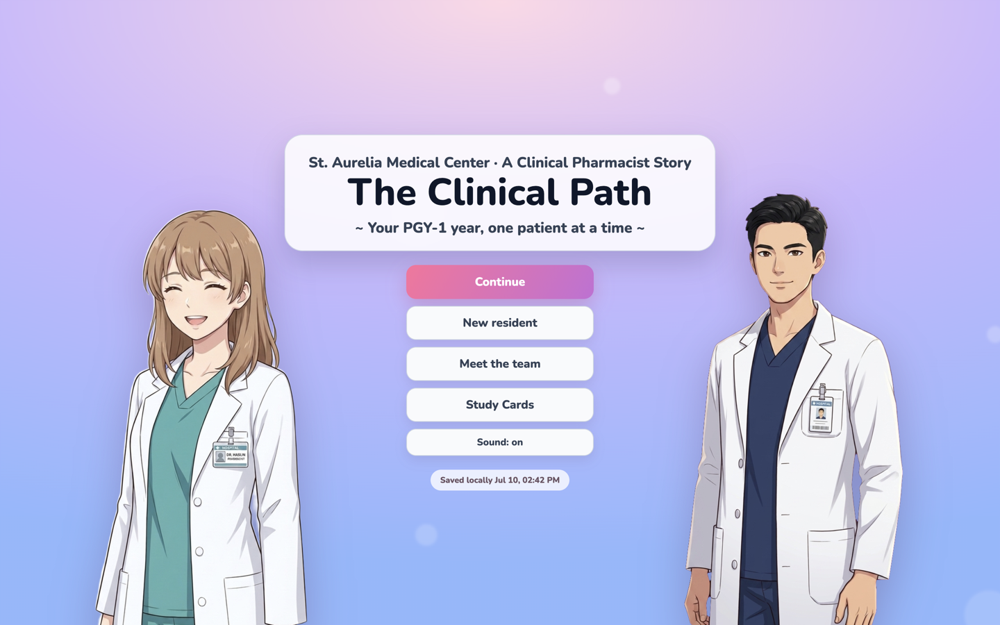
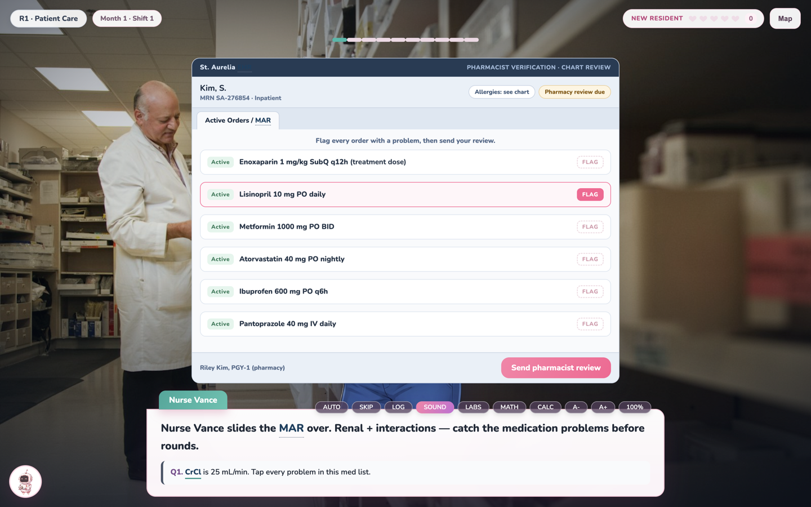
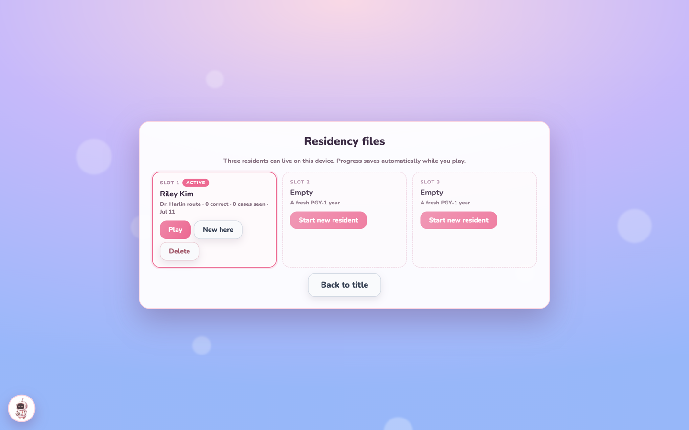

# The Clinical Path — PGY-1

A pharmacy residency onboarding sim, told like a visual novel.

You are a new PGY-1 resident at the fictional **St. Aurelia Medical Center**. Pick your resident, pick your preceptor, and work through a full residency year, one clinical decision at a time. Patient vignettes are used only when patient-specific data are actually provided; systems and workflow items are labeled separately.

**Play it now:** [Landing page](https://clinicalpharmacistmaker.vercel.app/) · [Full-screen demo](https://clinicalpharmacistmaker.vercel.app/demo.html)

## What's inside

**The clinical content**
- 69 guided rotations that mirror a real PGY-1 year, from Badge Day to precepting a student
- 457 curated clinical cases across nine formats: case decisions, chart review, SBAR building, verification queues, dose calculations, code blue, journal club, sequencing, and consult-style essays
- 457 case-derived study cards with spaced review and Quizlet-compatible export; dialogue and individual distractors are excluded
- A mock EHR chart-review window: patient banner, Orders/MAR, Labs, and Snapshot tabs, with flag-based pharmacist verification; every MAR exercise includes patient context and explicit review criteria
- An engine-specific Clinical Review after every case, including the full context, correct principle, patient reasoning when applicable, monitoring/follow-up, and references

**The story around it**
- Two preceptor routes: Dr. Harlin (ICU) or Dr. Daniel Park (EM), each with their own voice, portrait, role-labeled nameplate, and break-room backstories
- A bond system that unlocks real gameplay: case hints at *Warming up*, personal stories at *Trusted partner*
- A rival: co-resident Dr. Elliot Kang, who challenges you to quick-fire rounds face-offs all year and slowly becomes a friend
- Three longitudinal patient journeys that follow Mr. Alvarez, Ms. Chen, and Baby Kim across rotations, from crisis to discharge
- Pip, a helper bot that explains any screen and nudges your approach without ever spoiling an answer
- 15 achievements, streak tracking, chapter title cards, a simulated pre-rounding shift board, a preceptor review debrief, graduation epilogues, and ending credits

**Quality-of-life**
- Three save slots ("Residency files") with automatic migration of older saves
- Text speed, auto-advance, and sound settings
- Keyboard play: number keys choose answers, Space or Enter triggers the visible primary action, and H calls Pip
- Progress autosaves locally in the browser — no accounts, no servers, no data collection

## Honest scope

This is an **educational simulation and a design prototype**, not a certified training product.

- Every patient, clinician, and hospital in the game is fictional
- Case rationales reference real clinical reasoning patterns, but any institutional use should include licensed-pharmacist review of content and local policy
- Progress feedback is formative simulation evidence, not certification, and is stored only in the player's browser

## Tech notes

- The whole game is a single self-contained `demo.html` (no build step, no dependencies) plus a sprite folder
- Character sprites are AI-generated anime-style art created for this project; hospital backgrounds are Unsplash photography
- The landing page is a single `index.html`
- Local audit scripts cover catalog integrity, clinical accuracy, full interaction flow, and all 457 terminal-review paths

© The Clinical Path. Educational simulation — not medical advice.
